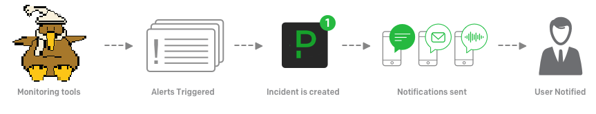

# OpenNMS PagerDuty Plugin [](https://circleci.com/gh/OpenNMS/opennms-pagerduty-plugin)




## Overview

This plugin allows you to create PagerDuty incidents that correspond to alarms in OpenNMS by integrating with the [Events API v2](https://developer.pagerduty.com/docs/events-api-v2/overview/).

OpenNMS alarms map naturally to incidents in PagerDuty:
* Events create incidents
* Events are deduplicated by the `dedup_key` (or `reduction key` in OpenNMS)
* Incidents can be acknowledged while someone is working on the problem
* Incidents are cleared when there is no longer a problem

The integration operates only in one direction currently (changes to alarms are pushed to PagerDuty), however future work could be done to achieve bi-directional communication by leveraing web hooks.

This plugin is compatible with OpenNMS Horizon 26.1.3 or higher.

## Usage

Download the plugin's .kar file into your OpenNMS deploy directory i.e.:
```
sudo wget https://github.com/OpenNMS/opennms-pagerduty-plugin/releases/download/v0.1.0/opennms-pagerduty-plugin.kar -P /opt/opennms/deploy/
```

Configure the plugin to be install when OpenNMS starts:
```
echo 'opennms-plugins-pagerduty wait-for-kar=opennms-pagerduty-plugin' | sudo tee /opt/opennms/etc/featuresBoot.d/pagerduty.boot
```

Access the [Karaf shell](https://opennms.discourse.group/t/karaf-cli-cheat-sheet/149) and install the feature manually to avoid having to restart:
```
feature:install opennms-plugins-pagerduty
``` 

Configure global options (affects all services for this instance):
```
config:edit org.opennms.plugins.pagerduty
property-set client OpenNMS
property-set alarmDetailsUrlPattern 'http://127.0.0.1:8980/opennms/alarm/detail.htm?id=%d'
config:update
```

Configure services:
```
config:edit --alias core --factory org.opennms.plugins.pagerduty.services
property-set routingKey "YOUR-ROUTING-KEY-HERE"
property-set jexlFilter 'alarm.reductionKey =~ ".*trigger.*"'
config:update
```

> Use the value of the "Integration Key" in the service integrations as the `routingKey`

### Alarm filtering

We currently only support JEXL expressions for controlling which alarms get forwarded to a given service.

You can use the `opennms-pagerduty:eval-jexl` command to help test expressions before committing them to configuration i.e.:
```
admin@opennms> opennms-pagerduty:eval-jexl 'alarm.reductionKey =~ ".*trigger.*"'
No alarms matched (out of 1 alarms.)
admin@opennms> opennms-pagerduty:eval-jexl 'alarm.reductionKey =~ ".*"'
MATCHED: ImmutableAlarm{reductionKey='uei.opennms.org/devjam/2020/minecraft/playerEnteredZone:mousebar:x_intercept', id=109, node=null, managedObjectInstance='null', managedObjectType='zone', type=null, severity=WARNING, attributes={}, relatedAlarms=[], logMessage='x_intercept has entered mousebar.', description='x_intercept has entered mousebar.', lastEventTime=2020-07-30 16:31:26.904, firstEventTime=2020-07-30 16:31:26.904, lastEvent=ImmutableDatabaseEvent{uei='uei.opennms.org/devjam/2020/minecraft/playerEnteredZone', id=195, parameters=[ImmutableEventParameter{name='zone', value='mousebar'}, ImmutableEventParameter{name='player', value='x_intercept'}]}, acknowledged=false}
```

## Developing

Build and install the plugin into your local Maven repository using:
```
mvn clean install
```

> OpenNMS normally runs as root, so make sure the artifacts are installed in `/root/.m2` or try making `/root/.m2` symlink to your user's repository

From the OpenNMS Karaf shell:
```
feature:repo-add mvn:org.opennms.plugins/pagerduty-karaf-features/1.0.0-SNAPSHOT/xml
feature:install opennms-plugins-pagerduty
```

Update automatically:
```
bundle:watch *
```

